# Integrantes do Grupo e Contribuições

Artur Vinícius Ilha Zimmermann (Documentação em Github)

Beatriz Ferreira de Oliveira Mendonça (Desenvolvimento dos códigos e implementação em hardware)

Luiz Felipe Sanches Azevedo (Desenvolvimento dos códigos e implementação em hardware)

Murilo Bisterzo Crepaldi (Desenvolvimento dos códigos e implementação em hardware)

Pablo Pereira Guelssi (Desenvolvimento dos códigos e implementação em hardware)

# Progresso do Grupo

Em primeiro lugar, o grupo estabeleceu uma conexão via cabo ethernet entre o terminal da máquina Windows que estava sendo utilizada e a placa Toradex VF50, utilizando protocolo SSH.

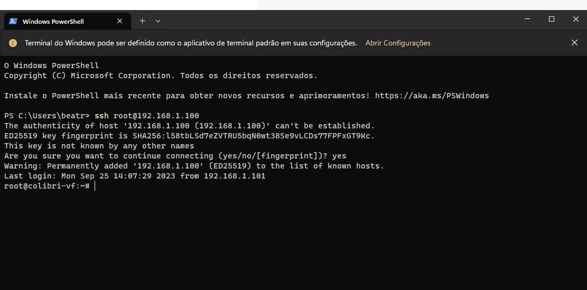

Na sequência, como o grupo não possuía uma uma máquina Linux à disposição, foi necessário instalar uma plataforma WSL para rodar o Linux dentro da máquina Windows. No entanto, esta plataforma não possuia todos os recursos que o grupo desejava utilizar, por isso foi necessário realizar um update da mesma e a aquisição de alguns pacotes adicionais para o projeto.

Um dos primeiros passos tomados pelo grupo, foi relembrar os procedimentos vistos em aula para transformar os códigos .c em arquivos executáveis. Para isso, foi primeiramente utilizado um arquivo de código teste de um simples "Hello World", primeiramente, através do comando "gcc" e, posteriormente, o comando "$cc".

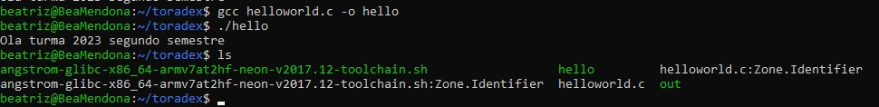

Logo após transformar o arquivo em executável na máquina Linux, o grupo enviou este arquivo para a placa a fim de verificar se o arquivo estava sendo corretamente executado na placa. Este processo é executado por meio da compilação cruzada, a qual exige que a seguinte função seja executada sempre que se deseja realizar a compilação cruzada do arquivo:

. /usr/local/oecore-x86_64/environment-setup-armv7at2hf-neon-angstrom-linux-gnueabi

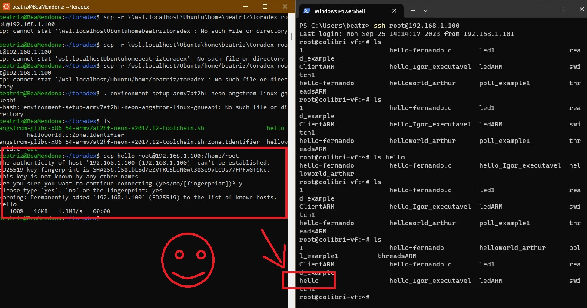
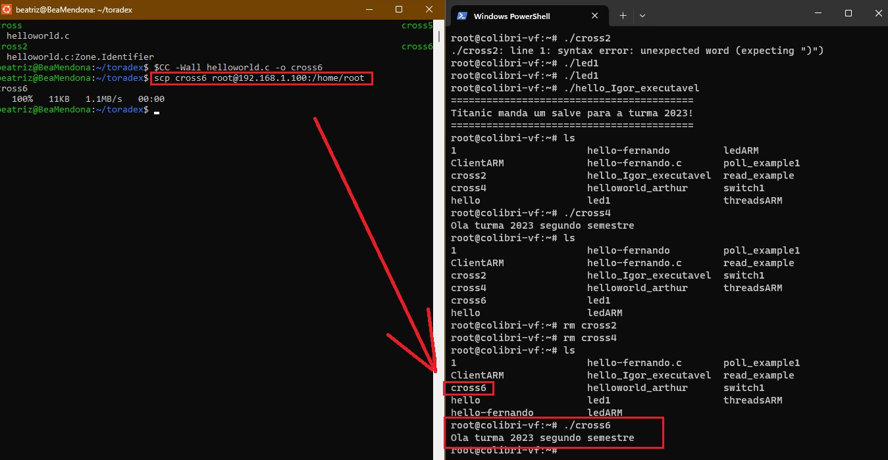

Vale ressaltar que, antes da compilação cruzada, foi necessário seguir os procedimentos expostos na aba de "Quick Start" referente à placa Toradex VF50, entre os quais constava: baixar, na máquina a ser utilizada, o SDK da placa.

Na sequência, o grupo consultou o datasheet da placa para aprender a operar as saídas PWM da mesma. Primeiramente, o grupo acessou a configuração prévia realizada pelo professor de duas saídas PWM na placa. Acessando estes arquivos, o grupo foi capaz de enviar os valores PWM desejados para o pino de saída. 

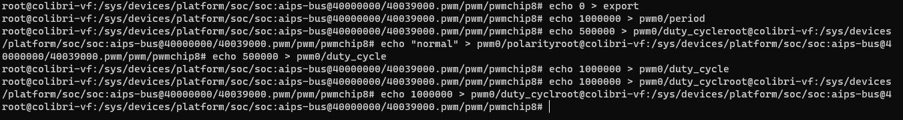
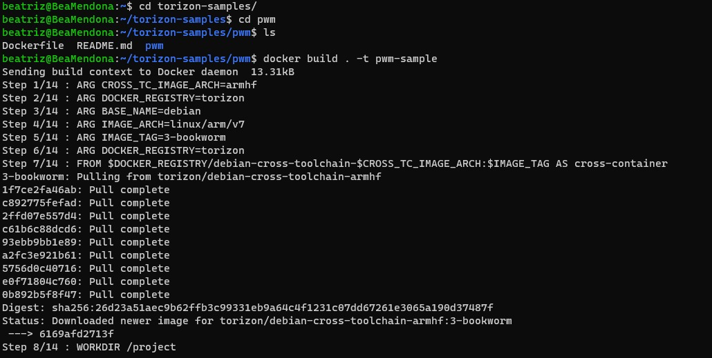
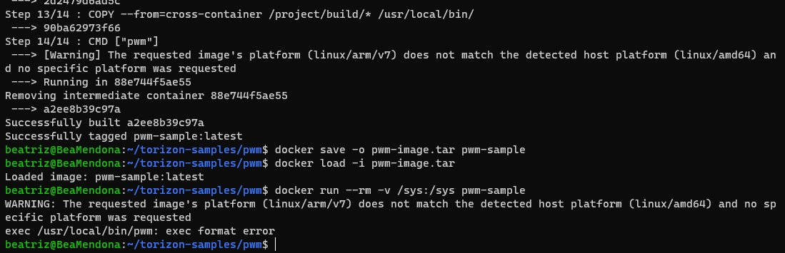
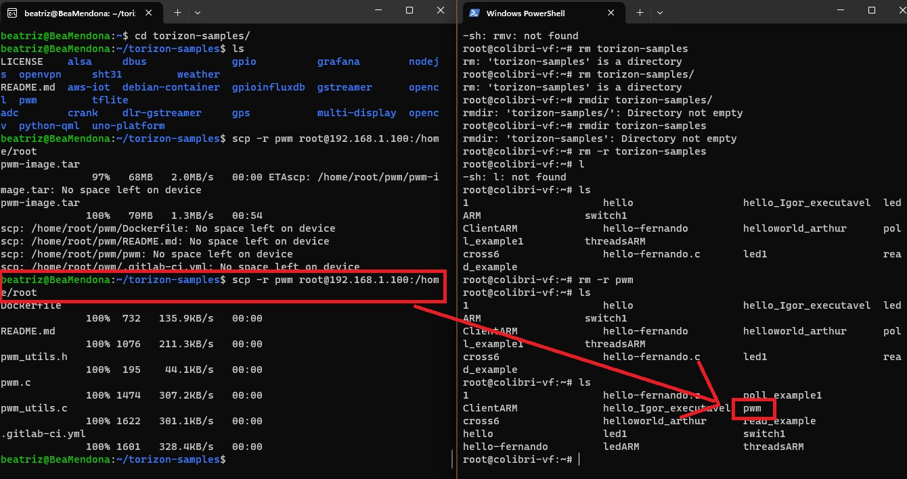
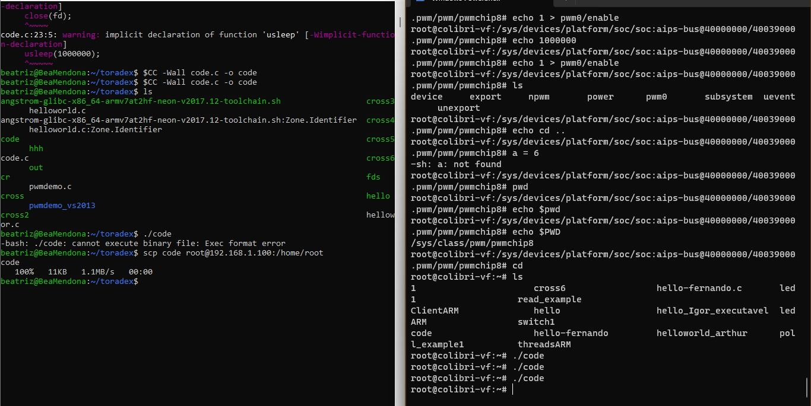

Para verificar este sinal de PWM imprimido pela linha de comando em Linux, foi conectado um osciloscópio ao pino de saída. Assim, o grupo foi variando os valores de PWM na máquina e observando o osciloscópio para verificar se a saída estava correspondendo aos valores impostos.

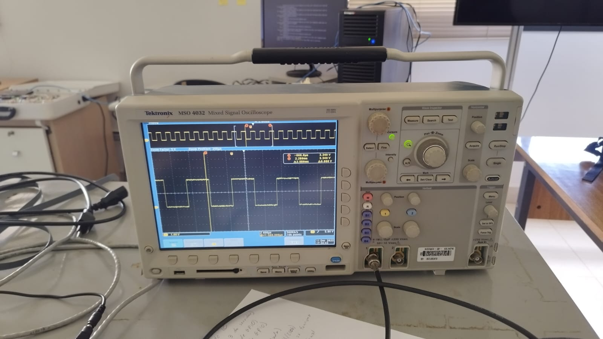

Na sequência, a partir do código de LED fornecido em aula pelo professor, o grupo construiu um código a ser executado na placa que, basicamente, cria uma saida PWM para o hardware embarcado Toradex VF50 + Carrier Board Viola e imprime um valor PWM nesta saída "repetindo" os procedimentos anteriormente descritos sem a necessidade de repetir toda intervenção manual realizada anteriormente.

Foram encontrados alguns problemas relacionados ao uso de dockers e containers pois a placa utilizada não possuía memória suficiente para utilizar estes recursos. Para contornar este problema, o grupo concluiu, junto ao professor, a necessidade de utilizar um código direto.

Até aqui, o código desenvolvido imprimia um valor de PWM na saída que permanecia o mesmo (src/v13_code.c). Assim, foi implementada uma interface interativa com o usuário que permitisse para ele controlar o "duty cicle" (tempo que o PWM permanece em nível 1) o que permite controldar a luminosidade do LED (src/v14_code.c). Isto seria o equivalente a controlar a velocidade do motor, não foi possível testar o mesmo no motor devido aos integrantes do grupo não estarem mais em São Carlos após o término do progresso aqui descrito.

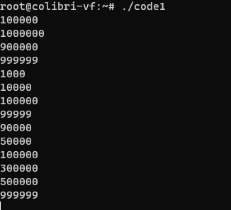

O vídeo do LED sendo controlado encontra-se na pasta de docs/progress_img.

Além disso, o professor contribuiu com um código com algumas melhorias a partir de feedbacks próprios (src/vglauco_code.c).
