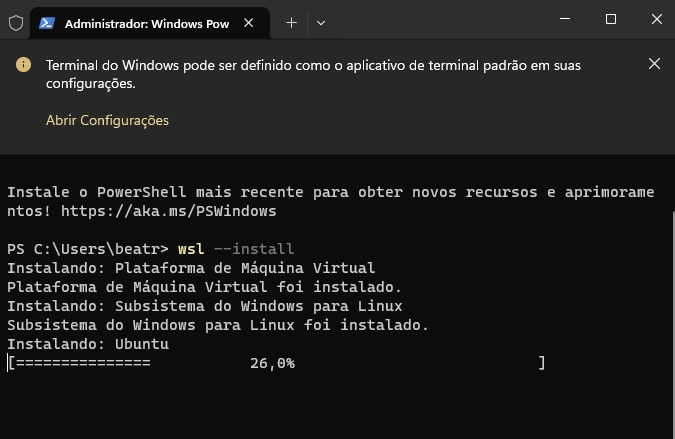

# Progresso do Grupo

Em primeiro lugar, o grupo estabeleceu uma conexão via cabo ethernet entre o terminal da máquina Windows que estava sendo utilizada e a placa VF50, utilizando protocolo SSH.

Na sequência, como o grupo não possuía uma uma máquina Linux à disposição, foi necessário instalar uma plataforma WSL para rodar o Linux dentro da máquina Windows. No entanto, esta plataforma não possuia todos os recursos que o grupo desejava utilizar, por isso foi necessário realizar um update da mesma e a aquisição de alguns pacotes adicionais para o projeto.

